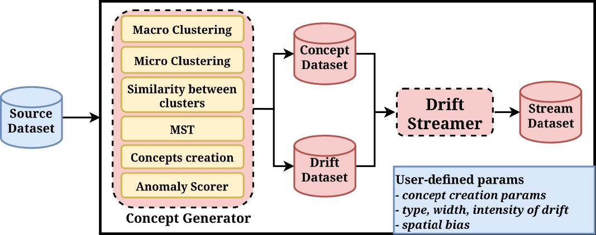

# REFINE-CDSG

This repository contains the implementation of the **Concept Drift Stream Generator (CDSG)** from the **REFINE framework**.

## Overview

**Concept Drift Stream Generator (CDSG)** generates a dataset with concept drift and spatial bias, based on user-defined parameters, while avoiding experimental biases related to time.

Unlike traditional approaches that rely on feature perturbation or sample interpolation, CDSG constructs concept drift directly from the structure of the original dataset, and streams the resulting data to simulate online scenarios with fine-grained and realistic control.

As shown in the figure below, CDSG consists of two main components:
- Concept Generator, which constructs the concepts from the original dataset by identifying clusters of similar concepts
- Drift Streamer,  which builds the final data stream with parameterizable drift characteristics



## Repository organization
This repository contains all components necessary for this project. 

| Component | Files/Directory | Purpose |
| :--- | :--- | :--- |
| **Concept Generator** | `concept_generator.py` | Concept generator class (`ConceptGenerator`) implementing the concept-generator logic. |
| **Streamer Generator** | `streamer_generator.py` | Streamer class (`StreamerGen`) implementing Drift Streamer logic. |
| **CDSG** | `cdsg.py` | Main class (`CDSG`) that coordinates and uses both `ConceptGenerator` and `StreamerGen` classes. |
| **Datasets** | `datasets/` |This directory contains the input source datasets, which for now should be flow-based datasets. |

Additionally, file `main.py` contains two complete examples of usage of the module and its components. 

---

## Requirements
This project requires Python3.x and the following dependencies.

### Prerequisites
Ensure you have pip (Python package installer) installed.

### Installation
All necessary dependencies can be installed using the `requirements.txt` file. These dependecies can be installed by running the following command in the terminal:
```bash
pip install -r requirements.txt
```
